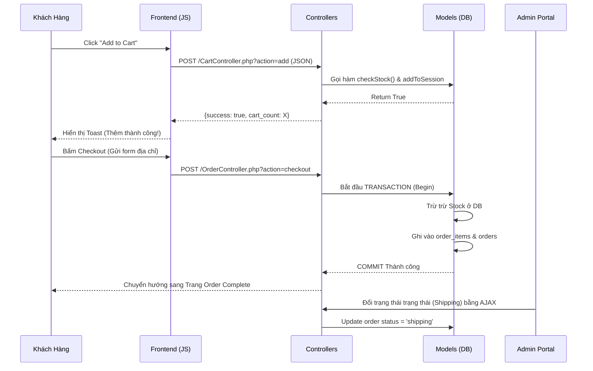

# Documentation: Feature Cart - Checkout - Orders 🛍️


**Module phụ trách:** Hệ thống Đơn hàng (Cart -> Checkout -> Sales Admin)
**Chi nhánh / Feature:** `feature/cart-checkout-orders`

Mục tiêu của module này là thiết kế và triển khai quy trình E-commerce hoàn chỉnh, bảo mật cao và tối ưu UX. Kiến trúc sử dụng **PHP 8.x + MySQLi (OOP Model-Controller)** kết hợp **Vanilla JS (Fetch API)** để xử lý các luồng động không cần tải lại trang (Single Page Application UX).

---

## 1. Kiến trúc Hệ Thống (Architecture Workflow)

Luồng xử lý từ lúc Khách hàng nhấn "Thêm vào giỏ" đến Admin Quản lý được mô tả qua sơ đồ sau:



---

## 2. Danh sách Tệp tin & Chức năng (Scope)

### Lớp Dữ liệu (Models Layer)
- **`models/Order.php`**: Xử lý 22 Hàm truy xuất hệ thống (từ Quản trị Giỏ Cục bộ đến Thống kê Doanh Thu Admin). Cốt lõi sử dụng `mysqli_prepare` để đóng đinh lỗi **SQL Injection**. Tích hợp `Transaction Rollback` chống thất thoát (Race Condition).
- **`models/OrderDetail.php`**: Chuyên biệt các hàm tính toán trừ kho và thao tác từng mã SKU rời rạc, tách bạch với đơn hàng mẹ.

### Lớp Điều hướng (Controllers Layer)
Thiết kế Restful định dạng JSON 100%.
- **`controllers/CartController.php`**: Endpoint gánh toàn bộ AJAX từ Add/Remove/Update số lượng đến Apply Coupon giảm giá.
- **`controllers/OrderController.php`**: Handler định tuyến cho Submit Checkout và là cầu nối xử lý các Request cập nhật trạng thái đơn tức thời từ Dashboard Admin.

### Giao diện Khách hàng (Customer Front-end)
- **`includes/navbar.php` & `includes/footer.php`**: Hook Javascript "tàng hình" được cắm vào để thiết lập **Mini-cart popup** trượt xuống khi Hover và hiển thị **Toast UI Global** đẹp mắt dưới góc trang. Chặn đứng các Form Submit lỗi thời.
- **`user/cart.php`**: Render Giỏ hàng chuẩn 3legant, tự động cập nhật Giá & Tổng tính toán trực tiếp qua fetch DOM thao tác giá trị.
- **`user/checkout.php`**: Trải nghiệm Thanh toán 1-Click có Auto-fill (điền sẵn form) nếu Khách có Session Login.
- **`user/order_complete.php` & `user/my_orders.php`**: Bảo vệ trang cuối khỏi Spam Refresh. List đơn hàng trang bị Lọc Tab theo Status xịn sò.

### Giao diện Quản trị viên (Admin Back-end)
- **`admin/orders/index.php`**: Bảng dữ liệu trang bị Widget thống kê tổng quan (Doanh thu, Đơn chờ xử lý) được bóc tách từ Dashboard. **Tính năng:** Đổi trạng thái thả Dropdown AJAX 1ms ngay trong lưới dữ liệu.
- **`admin/orders/detail.php`**: Layout xem Chi tiết chia đôi (Sản phẩm xuất/ Trạng thái & Tiền tệ).
- **`admin/inventory/index.php`**: Tracker theo dõi tồn kho. Áp dụng Rule cảnh báo đỏ gắt nếu Inventory ≤ 10 con. Tương tác nhập kho In-line.

---

## 3. Đặc tả API Nội bộ (API Specifications)

Hệ thống cung cấp Endpoint Backend độc lập. JS ở bất kì trang nào cũng có thể gọi.

### Thêm sản phẩm vào giỏ
- **URL:** `controllers/CartController.php?action=add`
- **Method:** `POST`
- **Body payload (JSON):**
  ```json
  {
    "product_id": 15,
    "quantity": 1,
    "color": "Black",
    "size": "L"
  }
  ```
- **Response:** `{"success": true, "message": "Đã thêm...", "cart_count": 3}`

### Admin Đổi trạng thái giao hàng
- **URL:** `controllers/OrderController.php?action=admin_update_status`
- **Method:** `POST` (FormData)
- **Tham số:** `order_id` (int), `status` (chuỗi enum: *pending, confirmed, shipping, delivered, cancelled*)
- **Response:** `{"success": true}`

---

## 4. Kiểm soát Bảo mật (Security Validations)

1. **Auto-seeder Tàng hình:** File `config/database.php` được chèn mạch theo dõi. Nếu hệ thống DB được setup mới tinh, nó tự gọi `seed.php` lấy 6 sản phẩm Demo chất lượng cao từ Cloud Unsplash bơm vào, tránh lỗi giao diện cho Dev khác clone về test.
2. **Ngăn chặn SQL Injection:** Tuyệt đối không nhúng `$variable` thẳng vào Query. Tất cả đều đi qua `$conn->prepare()` & `bind_param()`.
3. **Rollback Giao dịch Gốc:** Trong trường hợp Checkout (Cần ghi 1 bảng `orders`, 3 bảng `order_items`, và Update Kho `products`). Lệnh `$conn->begin_transaction();` được thả ở đầu. Nếu quá trình trừ hàng trong khi chạy xảy ra Lỗi (ví dụ Khách khác đã mua mất con hàng cuối cùng), luồng Code sẽ bắt Exception và xả `$conn->rollback()` cứu toàn bộ Data không sinh hoá đơn rác.
4. **Xử lý XSS:** Đầu ra hiển thị thông tin Input như `Full Name`, `Order code` đều bọc qua hàm diệt khuẩn `htmlspecialchars()`.

---

**Trạng thái Code:** `READY TO MERGE`. Mọi đoạn Script đều pass Tool Lint và không có config thừa. Toàn bộ logic Backend JSON hoàn chỉnh. Mời team vào băm! 🚀
